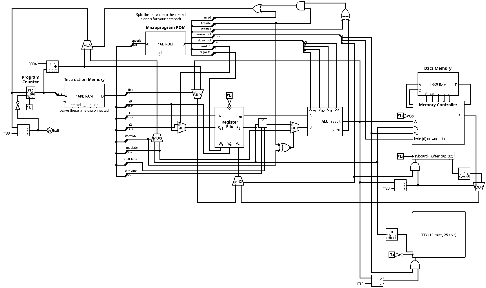
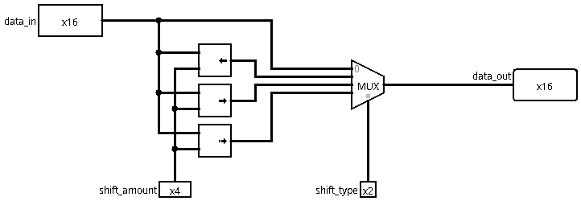
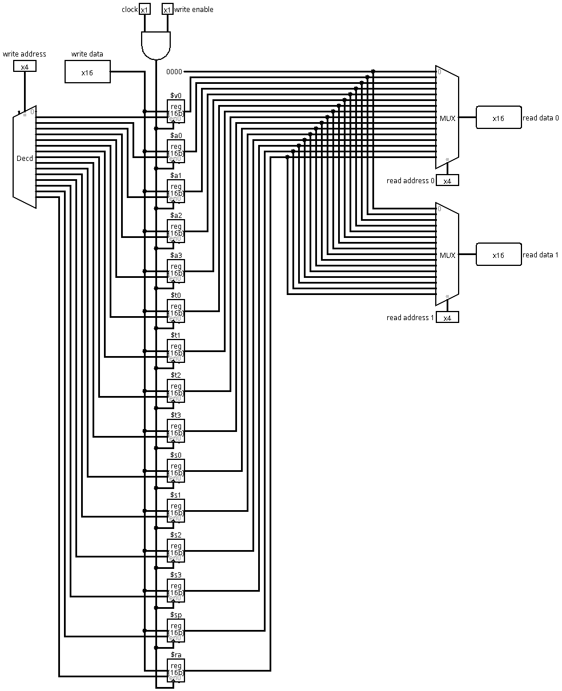
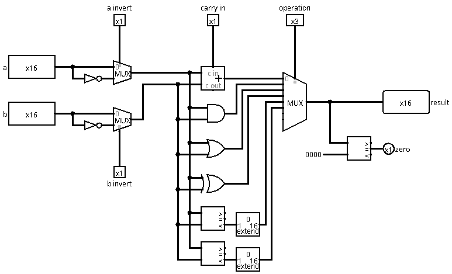
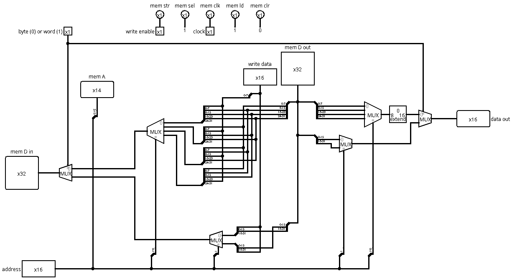

# PIPS Datapath


A single-cycle CPU implemented in Logisim for a custom instruction set architecture (ISA)
called PIPS. The project includes a microprogrammed control unit, memory-mapped I/O, and
a Python-based assembler, which we extended with custom rules to support our instruction set.

> Built as a project for **CSC 211: Computer Organization and Architecture** at Grinnell College.

---

## Table of Contents

- [Overview](#overview)
- [Features](#features)
- [Directory Structure](#directory-structure)
- [How to Run](#how-to-run)
- [Example Programs](#example-programs)
- [Circuit Previews](#circuit-previews)
- [Acknowledgements](#acknowledgements)

---

## Overview

This project demonstrates full-stack processor development, from instruction decoding to I/O integration:
- Designed and implemented a complete **single-cycle CPU datapath** using Logisim
- Extended a provided Python assembler by adding custom instruction rules for a variety of formats
- Authored **microprogram ROM entries** to generate control signals for each opcode
- Built support for **terminal output** and **keyboard input** via **memory-mapped I/O**
- Wrote and executed PIPS programs like **Fibonacci recursion**, **echo server**, and **string manipulation**

---

## Features

| Component        | Description |
|------------------|-------------|
| **ALU**        | Supports arithmetic, bitwise, and comparison ops via microprogram control |
| **Instruction Set** | Implements custom `R-type`, `I-type`, and pseudoinstructions (`li`, `push`, `pop`, etc.) |
| **Microprogram ROM** | Decodes opcodes into control signals (e.g., register write, ALU op, branch/jump logic) |
| **Assembler Rules** | Wrote new Python translation rules (in rules.py) extending a provided assembler framework (`pips.py`, `assembler.py`) |
| **Memory-Mapped I/O** | Connected Logisim terminal and keyboard devices to enable runtime interaction |
| **Test Programs** | Validated functionality with assembly-level tests for arithmetic, recursion, and user input |

---

## Directory Structure

```bash
pips-datapath/
├── datapath.circ             # Main Logisim circuit file
├── memory-controller.circ    # Memory file (provided)
├── microprogram.hex          # Microprogram ROM control signals (16-bit hex)
├── rules.py                  # Instruction rules for assembler
├── images/                   # Images from Logisim per circuit
│   ├── datapath.png
│   ├── shifter.png
│   ├── alu.png
│   ├── register-file.png
│   ├── memory-controller.png
├── programs/                
│   ├── instructions/         # PIPS assembly source files (.s)
│   │   ├── calculator.s     
│   │   ├── fibonacci.s
│   │   └── ...  
│   └── tests/                # Compiled machine code programs (.hex) for Logisim
│       ├── fibonacci.hex
│       ├── calculator.hex
│       └── ...
├── asm                       # Provided assembler entry point (provided)
├── assembler.py              # Assembler internals (provided)
├── pips.py                   # ISA definitions and utilities (provided)
└── README.md
```

---

## How to Run

1. Assemble a program:
  - A single program:
    ```bash
    ./asm -o programs/tests/fibonacci.hex programs/instructions/fibonacci.s
    ```
  - Multiple programs:
    ```bash
    ./asm -o programs/combined_tests.hex programs/instructions/*.s
    ```
2. Load into Logisim
   - Open `datapath.circ` in Logisim
   - Right-click the instruction memory → Load Image... → Select the .hex file
   - Run the simulation (Ticks Enabled or manual clock steps)
3. Run from terminal (optional):
    ```
    java -jar logisim.jar -tty tty -load programs/tests/fibonacci.hex datapath.circ
    ```

---

## Example Programs

- `fibonacci.s` – Recursive Fibonacci with stack management and number printing
- `string_reverse.s` – Reads a string via keyboard and prints it reversed
- `calculator.s` – Parses single-digit addition expressions with runtime I/O
- `echo.s` – Echoes keyboard input to terminal until newline is encountered

---

## Circuit Previews

Here are key subcomponents of the PIPS processor, as designed and assembled in Logisim:

| Circuit         | Description |
|----------------|-------------|
| **Datapath**   | Main CPU circuit connecting ALU, control logic, register file, PC, memory, and I/O |
| **Shifter**    | Custom-built subcircuit supporting logical/arithmetic shifts for R-type instructions |
| **Register File** | Provided 16-register module with dual-read and single-write ports (used as-is) |
| **Memory-Controller** | Provided subcomponent for managing word/byte reads/writes and supporting memory-mapped I/O |
| **ALU**        | Provided arithmetic/logic unit with support for bitwise ops and comparison flags |

> *Click to expand images*

### Datapath

> *Extended from a starter datapath file: implemented wiring, control signal logic, memory-mapped I/O, and microprogram integration.*

### Shifter

> *Implemented from scratch in Logisim to support `sll`, `srl`, and `sra`.*

### Register file

> *The register file was provided as part of the course starter files. Handles 16-bit storage of input/output, saved, and temporary registers.* 

### ALU

> *The ALU was provided as part of the course starter files. Handles arithmetic and comparison operations.*

### Memory-controller

> *The memory controller was provided as part of the starter files. It was integrated into the datapath to support byte/word memory operations (`lw`, `lb`, `sw`, `sb`) and facilitate memory-mapped I/O to terminal and keyboard devices.*

## Acknowledgements

This project was completed as part of CSC 211: Computer Organization and Architecture
at Grinnell College. Special thanks to [Prof. Jerod Weinman](https://weinman.cs.grinnell.edu)
and [Prof. Charlie Curtsinger](https://curtsinger.cs.grinnell.edu) for providing the starter
assembler and core architecture framework.

Parts of this project build upon original course materials distributed under the
[Creative Commons Attribution-NonCommercial-ShareAlike 4.0 International License](LICENSE)